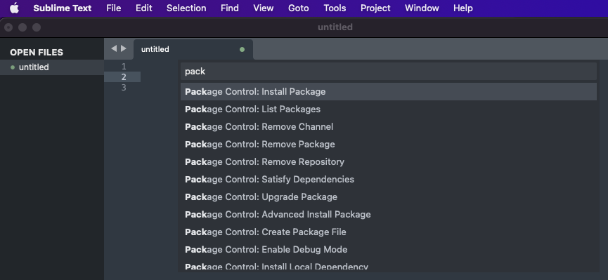
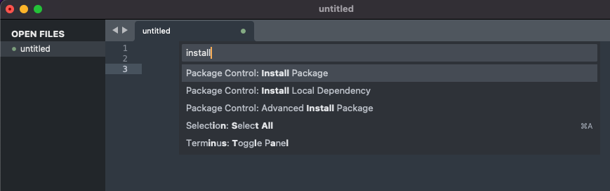
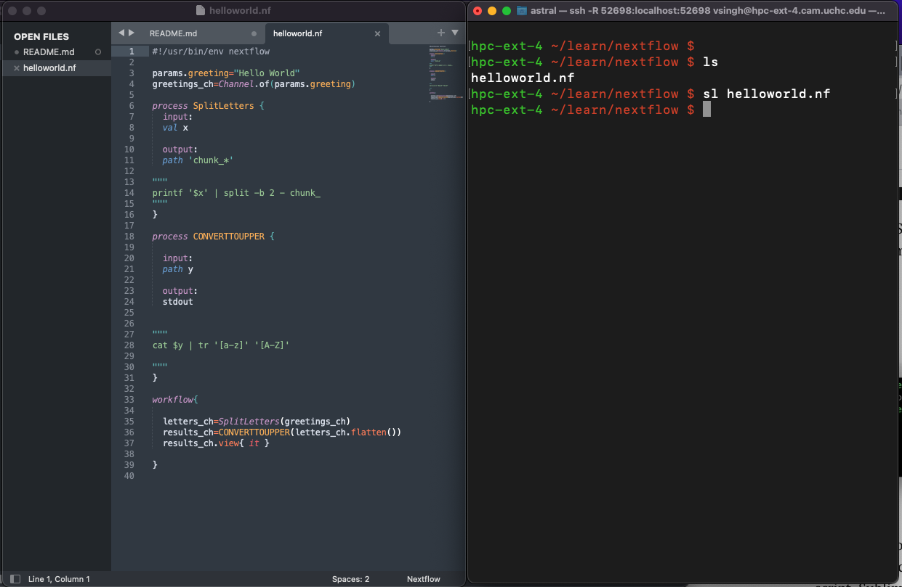

#### Guide to Connect Sublime Text to Linux Server.

This document will help you connect your local sublime text editor to remote server (e.g. Xanadu UConn Health HPC).  This will enable you open your cluster scripts with all the syntax colours and other cool features in Sublime on your local machine.  When you save the changes, the changes will be saved on the cluster file. The material here is a modification of contents from this page (https://data36.com/sublime-text-data-science-remote-server/)

#### STEP1.
> - Get sublime text (https://www.sublimetext.com/) and install on your local machine.
> - Open sublime from your `Applications` folder/directory in Mac and for windows you can search for it.
> - Sublime text has several plugins that can help you customise/modify it to suit your liking.  To do that you will need sublime package manager. So first we need to install sublime package control (manager). Go to **TOP MENU >Tools > command Palette** and search for **Package Control**. The moment you will type first few characters it will show you a list of options.  Please select `Package Control: Install Package`using your cursor key. As shown in . Once selected hit RETURN on your keyboard.  

*NOTE: Installation progress will be at the left bottom of the opened TAB for a few moments.  In most cases installations are instant so you will not see the progress.* 

> - Check for installation is executed properly.  For this search for package name listed in **TOP MENU > Sublime Text > Settings > Package Settings**. `Package Control` should be listed here otherwise the plugin installation has failed and you have to resolve the issue.

### STEP2 

Lets get another package/plugin installed.  It is **RemoteSubl**.  We follow the same steps as we have done for **Package Control**, except that it is now 2 step process.

> - **STEP-A** Open Pacakage Control **TOP MENU >Tools > command Palette** and search for `install`.  Among various options (if there are) choose **Package Control : Install Package** and hit RETURN.  This will open Package Control Install search at the same location.

> - **STEP-B** Search for **RemoteSubl**, then select it and install it.  Use your cursor keys to select between packages. You can check the package installation success in **TOP MENU > Sublime Text > Settings > Package Settings**

#### STEP3 
We are going to prepare our cluster/linux server/Xanadu account.  We will install `RemoteSubl` in there.
> - Login on your remote cluster `ssh <userID>@xanadu-submit-ext.cam.uchc.edu` or `ssh <userID>@serverIP` or `ssh <userID>@server.address` on terminal and use **putty** for windows.
> - To keep directory organised I would recommend create a directory `auzar` or anyother name of your choice. (Tools are Auzar in hindi language...so for fun)
> - Change directory to `auzar` using `cd auzar` and then execute following commands
```
curl -o . https://raw.githubusercontent.com/aurora/rmate/master/rmate

chmod 775 rmate

mv rmate sublime

```

> Now move to your home directory buy simply executing `cd`.  Open your `.bashprofile` (if not there create one) using nano and add the following two lines in there and **SAVE** it.
```
export PATH=~/auzar:$PATH.   # Add to your PATH environment variable
alias sl=~/auzar/sublime     # creates a shortname "sl" for sublime
``` 
**exit out of cluster** by typing exit or closing the terminal 


### HANG ON WE ARE ALMOST THERE !!!!!!

#### STEP4 (Mac Users)
##### (This is for Mac users, for Windows go to STEP6)

In this step we are going to enable tunelling (technical term) between our local machine(laptop) and the server.  The only change we will do to enable this is the way we connect to cluster.  Now onwards whenever we are going to connect to cluster we will execute

``` 
ssh -R 52698:localhost:52698 <userID>@xanadu-submit-ext.cam.uchc.edu # For Xanadu Users 

##or
ssh -R 52698:localhost:52698 ssh <userID>@serverIP

##or
ssh -R 52698:localhost:52698 ssh <userID>@server.address`

```

#### STEP5 (Mac Users)

I know !!! this is a lot to type/remember on terminal.  Lets creat a shortcut or alias for this connection.  For this go to your **Mac Terminal** and  execute 
```
echo $SHELL
```
> - If output is `/bin/zsh` .  Then open `.zshrc` file using nano and add the below line to it and save it.
```
alias xanadu="ssh -R 52698:localhost:52698 <userID>@xanadu-submit-ext.cam.uchc.edu"
```
> - If output is `/bin/bash` Then open `.bash_profile` file using nano and add the below line to it and save it.
```
alias xanadu="ssh -R 52698:localhost:52698 <userID>@xanadu-submit-ext.cam.uchc.edu"
```

Next time you want to connect to xanadu, simply type `xanadu` in terminal and hit return and terminal will connect you to the cluster.


#### STEP6 (Windows Users)

The instruction here are for folks who are using **putty** to connect to a linux server (e.g Xanadu).  If you are using anyother application please find the corresponding variables/settings and change them.

> - Open Putty
> - On left side under "Category" you should see `Session`, `Terminal`, `Window`, and `Connection` sub menus, if not hit the "+" against **Connection**.
> - Select **connection** and add following
```
Source Port : 52698
Destination : localhost:52698
SELECT Remote
SELECT Auto
CLICK Add
```
> - Select `Tunnels` under **SSH**.  If you donot see it hit "+" against **ssh**. If you have provided detaills correctly you should see these.
```
Forward Ports:  R52698 localhost:52698
Source port : 52698
Destination: localhost:52698
SELECTED : Remote
SELECTED : Auto
```

If yes, the go to **Sessions** menus and fill up connection configuration and **SAVE** it before you **load** so that you can use this connection again and again. To do this follow 

```
HostName : <userID>@xanadu-submit-ext.cam.uchc.edu
SELECT: SSH
Saved Sessions : xanadu
CLICK save
CLICK Load
```
You are all set.  Next time when you open putty double click `xanadu` under saved sessions (big window) and you will connect to cluster with all the settings you confiogured just now.


### FINAL SHOW DOWN !!!!!!

Login on the cluster mac users using shortcut `xanadu` in terminal and Windows folk by double clicking `xanadu` in putty.

Navigate to folder where you have your script, here I am using a nextflow script `helloworld.nf`. Once I am in the directory I will execute
```
sl helloworld.nf 
```
This will open the `helloworld.nf` on my local machine in sublime text.  You can make changes to script in Sublime Text and save it.  Your cluster script will be updated with the changes.



Source:  The instructions are modified from https://data36.com/sublime-text-data-science-remote-server/.


